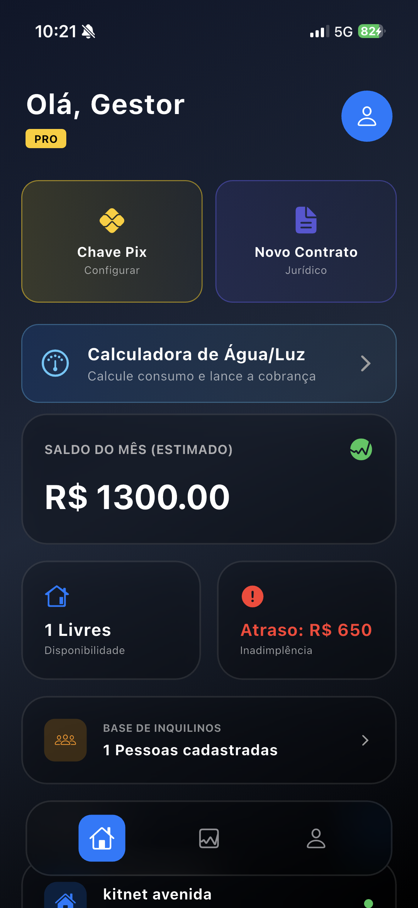
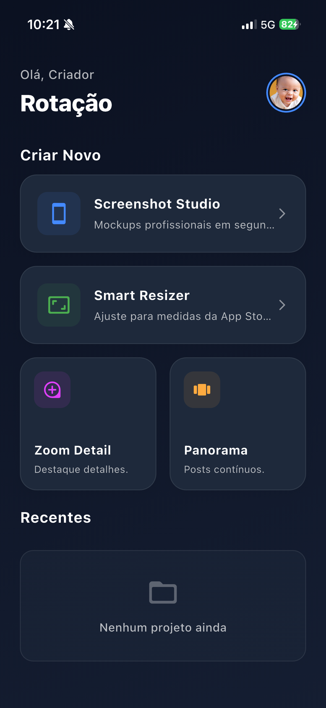
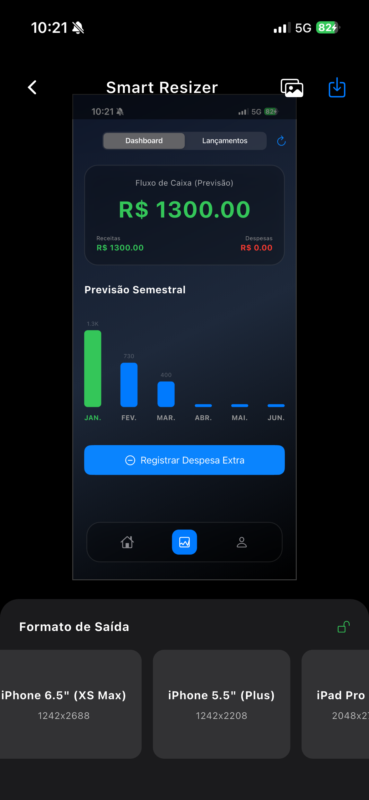
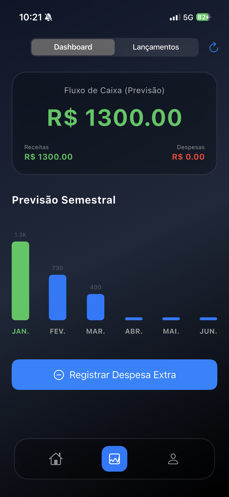

<html lang="pt-BR">
<head>
    <meta charset="UTF-8">
    <meta name="viewport" content="width=device-width, initial-scale=1.0, maximum-scale=1.0, user-scalable=no">
    <title>Grupo Dantas | Soluções Digitais</title>
    <link href="https://fonts.googleapis.com/css2?family=Inter:wght@300;400;600&family=Poppins:wght@500;700;800&display=swap" rel="stylesheet">
    <link rel="stylesheet" href="https://cdnjs.cloudflare.com/ajax/libs/font-awesome/6.4.0/css/all.min.css">
    <link href="https://unpkg.com/aos@2.3.1/dist/aos.css" rel="stylesheet">
    
    
</head>
<body>

    <header>
        

            
GrupoDantas

            <a href="https://wa.me/5519981117451" class="btn-contact">Orçamento</a>
        

    </header>

    <section class="hero">
        

            <h1>Transformamos ideias em Aplicativos de Sucesso</h1>
            
Especialistas em desenvolvimento mobile (Android & iOS) e sistemas de gestão.

        

    </section>

    <section class="container" style="padding-bottom: 100px;">
        
        

            

                Gestão Imobiliária
                <h3>App Minha Kitnet</h3>
                
Plataforma completa para gestão de aluguéis. Dashboard intuitivo, controle financeiro e cálculos automáticos.

                <ul class="features">
                    <li><i class="fa-solid fa-check"></i> Dashboard Gestor</li>
                    <li><i class="fa-solid fa-check"></i> Controle Financeiro</li>
                    <li><i class="fa-solid fa-check"></i> Backup Nuvem</li>
                </ul>
            

            

                

                    

                        
                    

                

            

        

        

            

                Produtividade & Design
                <h3>Rotação Criativa</h3>
                
Suite de ferramentas para criadores. Crie mockups, redimensione imagens para lojas e edite panoramas.

                <ul class="features">
                    <li><i class="fa-solid fa-check"></i> Smart Resizer (App Store)</li>
                    <li><i class="fa-solid fa-check"></i> Editor Panorama</li>
                    <li><i class="fa-solid fa-check"></i> Criador de Mockups</li>
                </ul>
            

            

                

                    

                        
                    

                

            

        

        

            

                Ferramenta Dev
                <h3>Smart Resizer</h3>
                
Ajuste automático de screenshots para os padrões exigidos pela App Store e Google Play.

                <ul class="features">
                    <li><i class="fa-solid fa-check"></i> Iphone 6.5" e 5.5"</li>
                    <li><i class="fa-solid fa-check"></i> Padronização Automática</li>
                    <li><i class="fa-solid fa-check"></i> Exportação Rápida</li>
                </ul>
            

            

                

                    

                        
                    

                

            

        

        

            

                Financeiro Avançado
                <h3>Controle de Fluxo de Caixa</h3>
                
Visualize receitas e despesas com clareza. Gráficos detalhados e previsibilidade financeira.

            

            

                

                    

                        
                    

                

            

        

    </section>

    <section class="legal-section">
        

            

                <h2 style="font-size: 2rem; margin-bottom: 10px;">Transparência e Segurança</h2>
                
Nossa conformidade com as diretrizes da Apple (App Store) e Google (Play Store).

            

            

                <a href="politica.html" class="legal-card">
                    <i class="fa-solid fa-shield-halved"></i>
                    <h4>Política de Privacidade</h4>
                    
Como coletamos e protegemos seus dados em todos os nossos aplicativos.

                </a>

                <a href="politica.html#termos" class="legal-card">
                    <i class="fa-solid fa-file-contract"></i>
                    <h4>Termos de Uso (EULA)</h4>
                    
Regras de utilização, responsabilidades e licenças de software.

                </a>

                <a href="politica.html#dados" class="legal-card">
                    <i class="fa-solid fa-database"></i>
                    <h4>Exclusão de Dados</h4>
                    
Solicite a remoção completa das suas informações dos nossos servidores.

                </a>
            

        

    </section>

    <footer>
        

            
GrupoDantas

            
Desenvolvendo o futuro do seu negócio.

             
            <a href="app-ads.txt" style="color: #475569; font-size: 0.8rem; border: 1px solid #334155; padding: 5px 10px; border-radius: 5px; text-decoration: none;">AdMob Validation</a>
            
&copy; 2026 Grupo Dantas.

        

    </footer>

    <a href="https://wa.me/5519981117451" class="whatsapp-float" target="_blank"><i class="fa-brands fa-whatsapp"></i></a>

    
    
</body>
</html>
    
